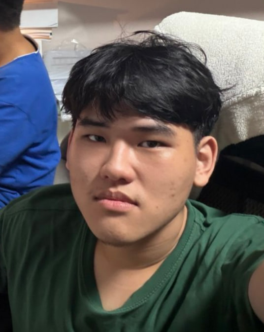
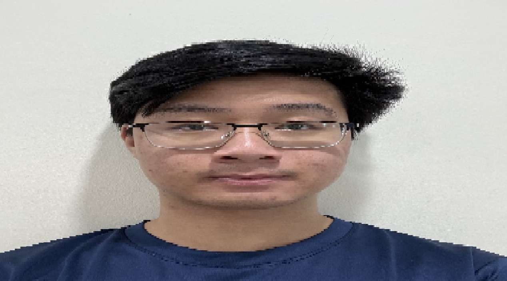

# About Us

We are a team based in the [School of Computing, National University of Singapore](http://www.comp.nus.edu.sg).

You can reach us at the email `seer[at]comp.nus.edu.sg`

## Project team

### Lee Qi Zheng

[[github](https://github.com/iamqz)]

* Role: Team Lead, Scheduling & Deliverables
* Responsibilities: Overall project coordination, defining, allocating and tracking tasks, ensuring tasks are done on time and in the right format

### Nguyen Huy Dat (Andrew)

[[github](http://github.com/andrew250402)]

* Role: Documentation, Code Quality
* Responsibilities: Quality of various project documents, ensuring adherence to coding standards and code quality

### Ronald Pang

[[github](http://github.com/frrostyboi)]

* Role: Code Quality, Integration
* Responsibilities: Versioning of the code, maintaining the code repository, integrating various parts of the software to create a whole

### Sherman Liam

[[github](http://github.com/Siimen111)]

* Role: Testing
* Responsibilities: Ensuring the various features and components of the project work as intended
