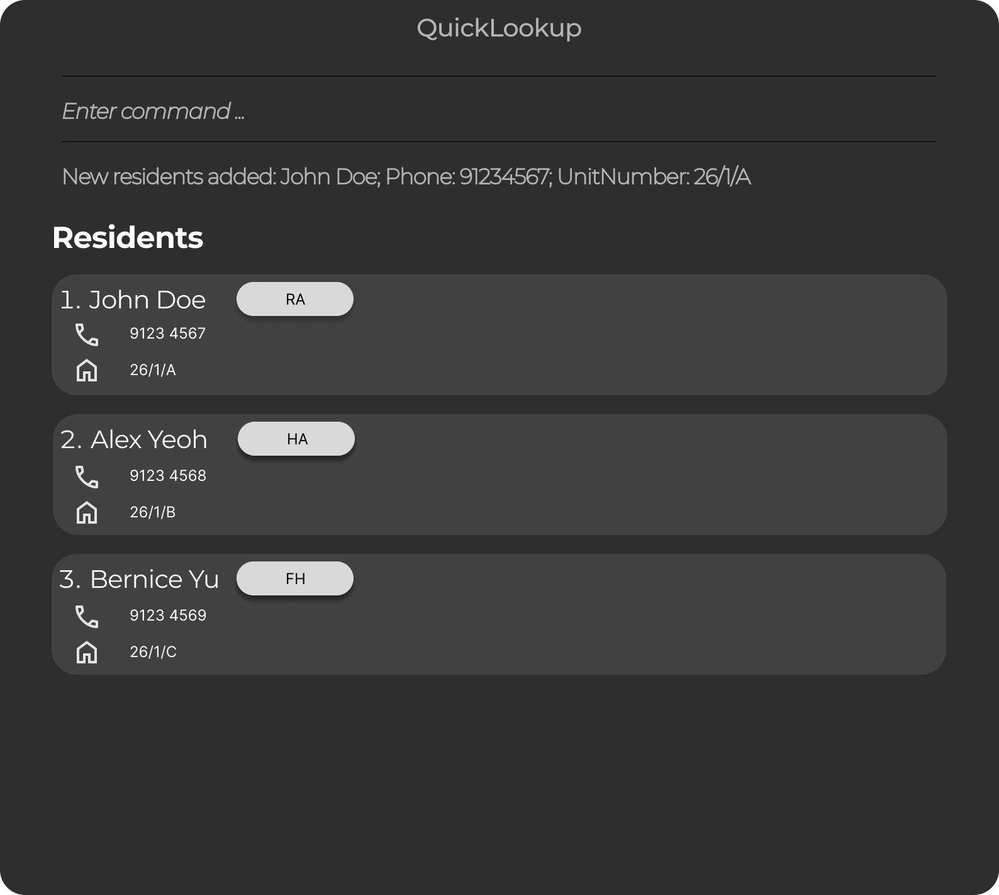

# QuickLookup

**QuickLookup** is a desktop application for managing a list of residents, optimized for users who prefer fast keyboard input via a **Command Line Interface (CLI)** while still providing a **Graphical User Interface (GUI)** for visual feedback.

It allows users to quickly **add, remove, and view residents** in a locally stored list.

**Acknowledgements**

* Libraries used: [JavaFX](https://openjfx.io/), [Jackson](https://github.com/FasterXML/jackson), [JUnit5](https://github.com/junit-team/junit5)
* The project is based on the AddressBook-Level3 project created by the [SE-EDU initiative](https://se-education.org).
